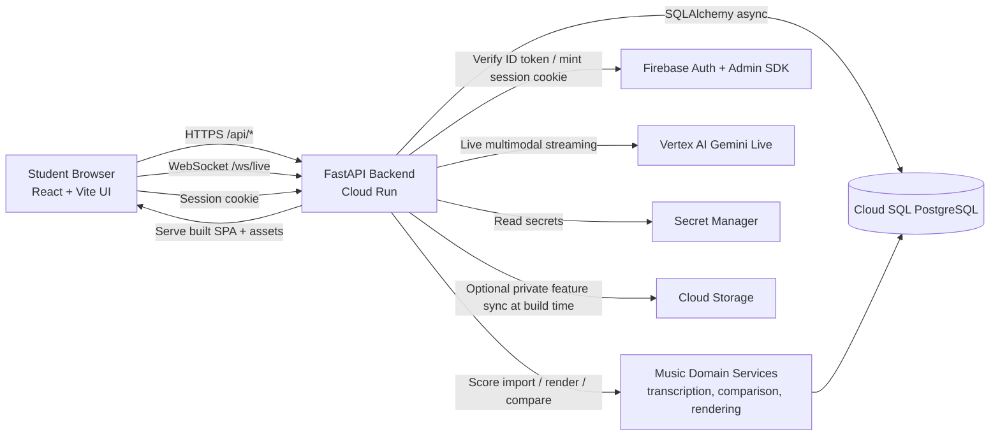

# Eurydice

<p align="center">
  
</p>

**A real-time multimodal music tutor built for the Gemini Live Agent Challenge.**

Eurydice can hear a student play, read their score via the camera, coach them bar by bar in voice, and adapt the lesson live until the phrase is learned.

## Quick Start

### For Users
1. Navigate to the deployed Eurydice application
2. Sign in with Firebase (anonymous or email/password)
3. Select a music skill (GUIDED_LESSON, HEAR_PHRASE, etc.)
4. Enable microphone for audio feedback
5. Optional: Enable camera for score reading
6. Start your music practice session!

### For Developers
See the [Local Setup Guide](docs/LOCAL_SETUP.md) for detailed instructions on running Eurydice locally.

## Features

🎵 **Unified Guided Lesson Loop:**
- **Prepare lesson** - Import/prepare notation and set the active bar sequence
- **Compare bar** - Record one take and run deterministic bar comparison
- **Advance bar** - Move to the next bar only after review criteria are met
- **Capture phrase (helper)** - Analyze short melodic phrases without leaving the lesson surface
- **Read from camera (helper)** - Capture one readable bar into the same lesson workflow

🎤 **Real-time Audio Analysis:**
- Monophonic pitch detection using FastYIN
- Optional CREPE verification for higher accuracy
- Silence detection and note segmentation
- Frame-level pitch contour with contour-based note grouping
- Interval and chord analysis

🎹 **Music Capture Mode:**
- Adaptive energy-gated recording (`mode: "music"`) with onset detection
- Disables speech DSP (echo cancellation, noise suppression, auto gain)
- Pre-roll preservation so note attacks aren't clipped
- Configurable trailing silence timeout and max duration
- Falls back to fixed-duration capture when no onset is detected
- Speech mode (`mode: "speech"`) remains the default for backward compatibility

📷 **Computer Vision:**
- Camera-based score reading
- Sheet music framing assistance
- Real-time visual feedback

🔄 **Live AI Interaction (Assistant Layer):**
- WebSocket connection to Gemini Live API
- Camera-assisted score capture for readable bar extraction
- Deterministic lesson actions remain the source of truth for pacing and progression
- MCP-style live tool routing (`client.tool` + `server.tool_result`) for deterministic lesson/score actions
- Optional model-triggered `TOOL_CALL` handling with backend execution and `TOOL_RESULT` feedback
- Tool reliability telemetry (`/api/music/analytics/live-tools`) with per-tool success/failure rates
- Failure-category breakdown (`VALIDATION`, `AUTH`, `TIMEOUT`, etc.) plus recent live-tool call history

## Repository Structure

This repository is organised into two main parts:

* `backend/` — A FastAPI service that exposes REST endpoints for session management, music score import/rendering, guided lesson workflows, user authentication via Firebase, and a WebSocket endpoint that proxies audio/video to the Gemini Live API. The service is designed to run on Google Cloud Run and connect to a Cloud SQL (PostgreSQL) database.
* `frontend/` — A Vite + React front-end. Its production build is served by the FastAPI backend when a `dist/` build is present. The legacy `backend/app/static/` client remains as a fallback and reference implementation during the transition.

### Key Directories
```
vista/
├── backend/
│   ├── app/
│   │   ├── domains/        # Domain-driven design modules
│   │   │   └── music/      # Music domain (transcription, comparison, rendering)
│   │   ├── live/           # Gemini Live API bridge
│   │   ├── static/         # Frontend browser client
│   │   ├── main.py         # FastAPI application entry point
│   │   ├── settings.py     # Environment configuration
│   │   └── db.py           # Database setup
│   ├── tests/              # Comprehensive test suite
│   ├── requirements.txt    # Base Python dependencies
│   └── Dockerfile          # Production container image
├── docs/                   # Documentation
│   ├── AUDIT_REPORT.md     # Codebase audit and recommendations
│   ├── EURYDICE_CHALLENGE_BRIEF.md  # Product specification
│   ├── CONTENT_INGESTION_AND_CURATION.md  # Content library and guided pack workflow
│   ├── LOCAL_SETUP.md      # Development setup guide
│   ├── DEPLOYMENT.md       # Cloud Run deployment instructions
│   └── CONSTITUTION.md     # AI system instructions
└── infra/                  # Infrastructure and deployment scripts
    └── deploy_cloudrun.sh  # Cloud Run deployment automation
```

## Architecture Overview

Eurydice is built as a single deployed backend with a React frontend build embedded into the container. Deterministic lesson actions, score processing, auth, and live AI streaming all pass through the same FastAPI service.



Runtime responsibilities:
- `frontend/` is the primary product surface and is built into the backend container.
- `backend/app/main.py` serves the SPA, API routes, and live websocket bridge.
- `backend/app/domains/music/` holds deterministic lesson logic, notation render, transcription, comparison, adaptive recommendations, and live tool execution.
- `backend/app/static/` remains a fallback/reference client while any remaining edge cases are retired.

## Setup overview

Use Python `3.11`, `3.12`, or `3.13` for local development. Python `3.14` is not supported yet by the pinned dependency stack.

1. **Enable required services**: Ensure the following Google Cloud services are enabled in your project: `aiplatform`, `run`, `cloudsql`, `secretmanager`, and `iam`.
2. **Create a Cloud SQL database**: Provision a Postgres instance and create a database for sessions. Update the environment variables in the Cloud Run deployment script accordingly.
3. **Configure Firebase**: Add Firebase to your project, enable authentication, and provide a service account JSON for server-side token verification. The backend expects a Firebase ID token for each HTTP/WebSocket request.
4. **Deploy the backend**: Use the provided Dockerfile and `deploy_cloudrun.sh` script in the `infra/` directory to build and deploy the FastAPI service. The script sets environment variables needed by the application.
5. **Install music extras** (optional): For SVG score rendering install `pip install -r backend/requirements-music.txt`. For advanced audio analysis (CREPE pitch verification) install `pip install -r backend/requirements-music-ml.txt`.
6. **Live retrieval context** (recommended): Enable `VISTA_LIVE_CONTEXT_ENABLED=true` so live sessions receive a compact context packet built from profile, recent attempts, and relevant content library items.

For more details about the product specification, refer to `docs/EURYDICE_CHALLENGE_BRIEF.md`. For deployment instructions, see `docs/DEPLOYMENT.md`.

## Technology Stack

### Backend
- **FastAPI** - Modern async web framework
- **SQLAlchemy** - Async ORM with PostgreSQL
- **Firebase Admin SDK** - Authentication
- **Vertex AI** - Gemini Live API integration
- **Verovio** (optional) - Music notation rendering
- **CREPE** (optional) - ML-based pitch detection

### Frontend
- **React 19** - Main frontend UI
- **Vite** - Frontend build/dev pipeline
- **Tailwind CSS** - Styling
- **Headless UI** - UI primitives
- **Firebase Web SDK** - Client-side authentication
- **MediaDevices / Web Audio APIs** - Audio/video capture
- **WebSocket** - Real-time communication

### Infrastructure
- **Google Cloud Run** - Serverless container hosting
- **Cloud SQL (PostgreSQL)** - Managed database
- **Secret Manager** - Credential storage
- **Docker** - Containerization

## Development

### Current developer tooling
- **pytest / pytest-asyncio** - Backend tests
- **ESLint** - Frontend linting via `frontend/package.json`
- **Vitest** - Frontend unit tests
- **Vite** - Frontend build and dev server

The repo does not currently ship committed Black, Flake8, Prettier, or pre-commit configuration. Keep the README aligned with the actual checked-in tooling rather than an aspirational stack.

### Running Tests
```bash
# Backend tests from repo root
pytest backend/tests

# Prompt quality evaluation from repo root
python backend/scripts/prompt_eval_music.py

# Run one backend test module
pytest backend/tests/test_music_transcription.py

# Frontend lint, tests, and build
npm --prefix frontend run lint
npm --prefix frontend run test
npm --prefix frontend run build
```

### Music Capture Mode

The frontend audio capture function `capturePcmClip` supports two modes:

- **`"speech"` (default):** Fixed-duration capture with speech-oriented DSP (echo cancellation, noise suppression, auto gain control). This is the existing behaviour and remains the default when no arguments are passed.

- **`"music"`:** Adaptive energy-gated capture optimised for musical input. DSP flags are disabled to preserve tonal fidelity. Recording starts when a phrase onset is detected (energy rises above `onsetThresholdDb` for a few consecutive frames) and stops after `trailingSilenceMs` of silence or when `maxMs` is reached. A 200 ms pre-roll is preserved so note attacks aren't clipped. If no onset is detected within `durationMs`, the function falls back to fixed-duration behaviour.

```js
import { capturePcmClip } from "../lib/audioCapture";

// Default speech mode (backward compatible)
const clip = await capturePcmClip();

// Music mode with adaptive capture
const clip = await capturePcmClip({
  mode: "music",
  trailingSilenceMs: 400,
  onsetThresholdDb: -45,
  maxMs: 10000,
});
```

On the backend, `transcribe_pcm16` now uses frame-level pitch contour analysis (10 ms hop) for improved note segmentation. Contiguous frames with stable pitch and sufficient confidence are grouped into note events. The legacy energy-gate segmentation is used as a fallback when the contour yields no notes.

### Deployment-sensitive notes

- Auth is frontend Firebase sign-in plus backend-issued HTTP-only Firebase session cookies.
- The backend needs a valid Firebase Admin SDK JSON to mint session cookies. If Cloud Run logs show `invalid_grant: Invalid JWT Signature.`, rotate the `vista-firebase-adminsdk` secret and redeploy.
- Landing-page feature art is intentionally not tracked in git. Mirror local assets into the private bucket with:

```bash
FRONTEND_FEATURES_URI=gs://YOUR_BUCKET/features bash infra/sync_feature_assets.sh
```

## Documentation

- **[Product Specification](docs/EURYDICE_CHALLENGE_BRIEF.md)** - Comprehensive challenge brief
- **[Content Ingestion & Curation](docs/CONTENT_INGESTION_AND_CURATION.md)** - Library metadata, curation and guided pack loading
- **[Local Setup](docs/LOCAL_SETUP.md)** - Step-by-step development guide
- **[Deployment](docs/DEPLOYMENT.md)** - Cloud Run deployment instructions
- **[Constitution](docs/CONSTITUTION.md)** - AI system behavior rules
- **[Audit Report](docs/AUDIT_REPORT.md)** - Codebase audit and improvements

## Security & Privacy

- All browser auth flows terminate in a backend-issued HTTP-only session cookie
- Session ownership validation on all endpoints
- Input sanitization for user-provided data
- Secret Manager for runtime credentials in Cloud Run
- Private landing-page assets can be fetched at build time from Cloud Storage instead of being committed to git
- No production credentials should be stored in source control

## License

This project is built for the Gemini Live Agent Challenge.

## Contributing

This is a hackathon project with a deadline of **March 16, 2026**. For code quality standards and improvement suggestions, see [Audit Report](docs/AUDIT_REPORT.md).
