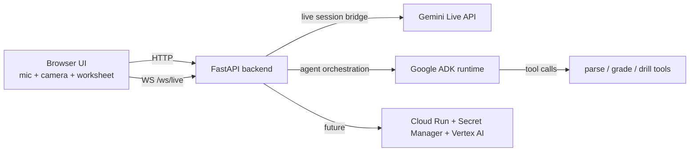

# Architecture

## Intent

This scaffold targets a voice-first multimodal tutoring flow:

1. the learner speaks or uploads a worksheet image in the browser
2. the frontend opens a live session against the backend
3. the backend brokers Gemini Live state and ADK orchestration
4. tutor tools enrich the interaction with parsing, grading, and drill generation

## Current scaffold

```text
Frontend (Vite + React)
  -> session setup and media readiness
  -> runtime / mode fetch
  -> live session bootstrap request
  -> transcript + morphology placeholders

Backend (FastAPI)
  -> /api/runtime
  -> /api/live/modes
  -> /api/live/session
  -> /ws/live Gemini Live bridge (+ scaffold fallback when credentials are missing)

Agent layers
  -> prompts.py
  -> session_state.py
  -> modes.py
  -> tools/
  -> live/gemini_live.py
  -> live/protocol.py
  -> orchestration/adk_runtime.py
```

## Planned runtime shape



## Design choices

- Keep frontend and backend separate at the repo root so each can evolve independently.
- Keep live transport, tool definitions, and orchestration in separate modules so we can swap placeholder code for real implementations without reshaping the API surface.
- Avoid database or auth work until the live tutoring loop is stable.
- Target Cloud Run conceptually, but stop short of adding infrastructure code that would be guesswork at this stage.

## What is real today

- Browser-side preparation for microphone, camera, and worksheet image intake
- A bootstrap API that returns mode metadata, registered tools, prompt preview, and live session configuration
- A stable websocket path the frontend can code against immediately
- A typed websocket contract documented in `docs/live-event-contract.md` and mirrored in backend/frontend source

## What comes next

1. Build the first ADK orchestration pass around tutoring turns and tool routing.
2. Implement deterministic outputs for parsing, grading, and drill generation.
3. Add persistence for session state and learner progress.
